# slidev-theme-light-icons

[](https://www.npmjs.com/package/slidev-theme-light-icons)

- A light and Elegant theme for [Slidev](https://github.com/slidevjs/slidev).
- This theme contains collection of amazing & light-weighted icons called the `light-icons`.

#### Live demo: [Click Here](https://slidev.icons.lightvue.org).

For more information about `light-icons`. Visit [Light Icons](https://lightvue.org/getting-started/light-icons).

---

### 100% Light & Dark Compatible 
All themes are compatible with `light` & `dark` mode

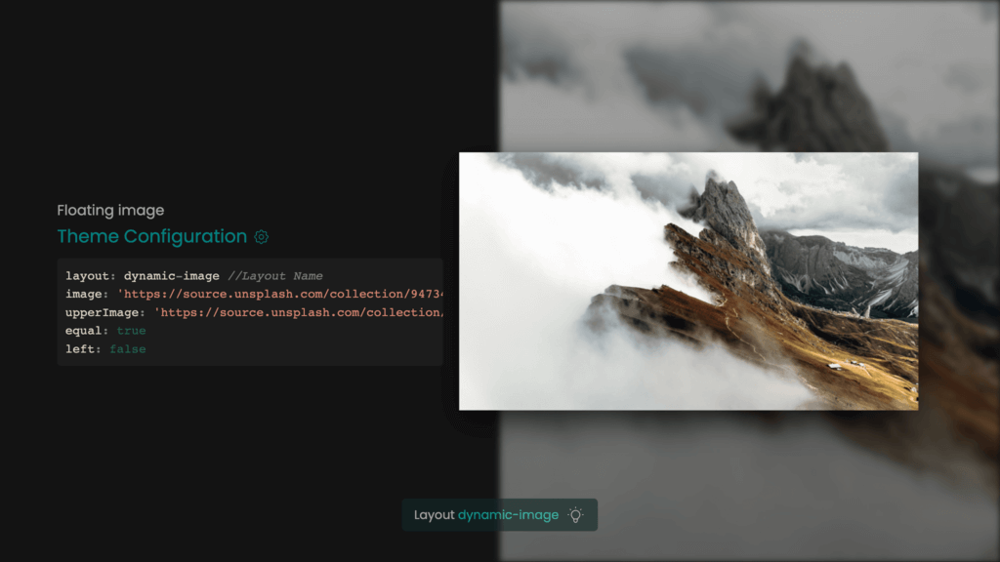

## Install

Add the following frontmatter to your `slides.md`. Start Slidev then it will prompt you to install the theme automatically.

<pre><code>---
theme: <b>light-icons</b>
---</code></pre>

Learn more about [how to use a theme](https://sli.dev/themes/use).

## Layouts

This theme provides the following layouts:
#### Intro `intro`
Usage:

```
---
layout: intro
image: 'https://source.unsplash.com/collection/94734566/1920x1080'
---
```

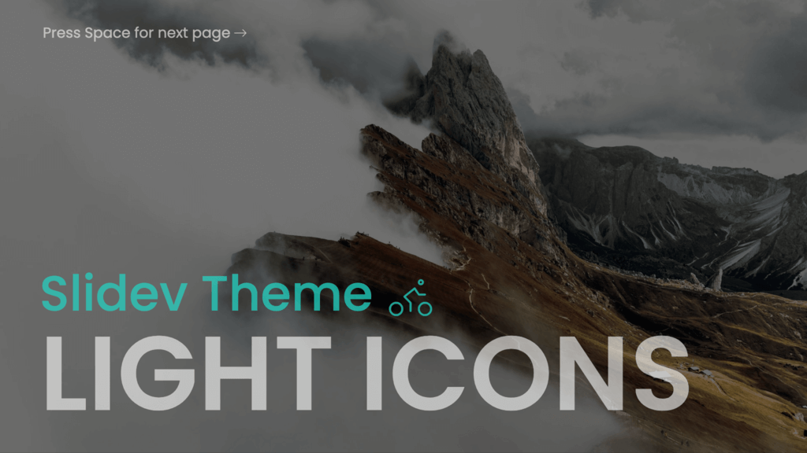

---


#### Intro with icon `image-header-intro`
Usage:

```
---
layout: image-header-intro
imageHeader: '../assets/images/light-icon-logo.svg'
imageRight: '../assets/images/light-icons-landing.svg'
---
```

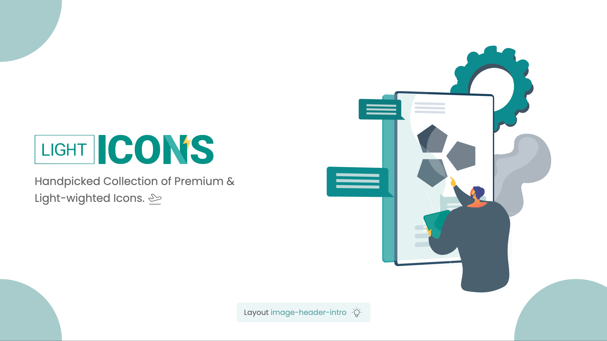

---

#### Dynamic Image `dynamic-image`
Usage:

```
---
layout: dynamic-image
image: 'https://source.unsplash.com/collection/94734566/1920x1080'
equal: true
left: false
---
```

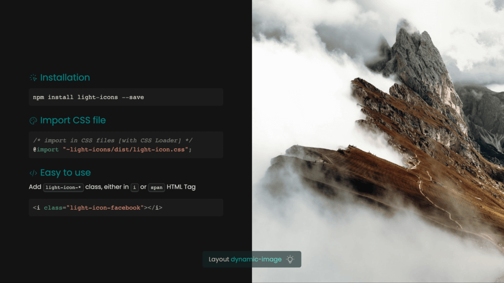

---

#### Dynamic Image `dynamic-image`
Usage:

```
---
layout: dynamic-image 
image: 'https://source.unsplash.com/collection/94734566/1920x1080'
equal: false
left: false
---
```

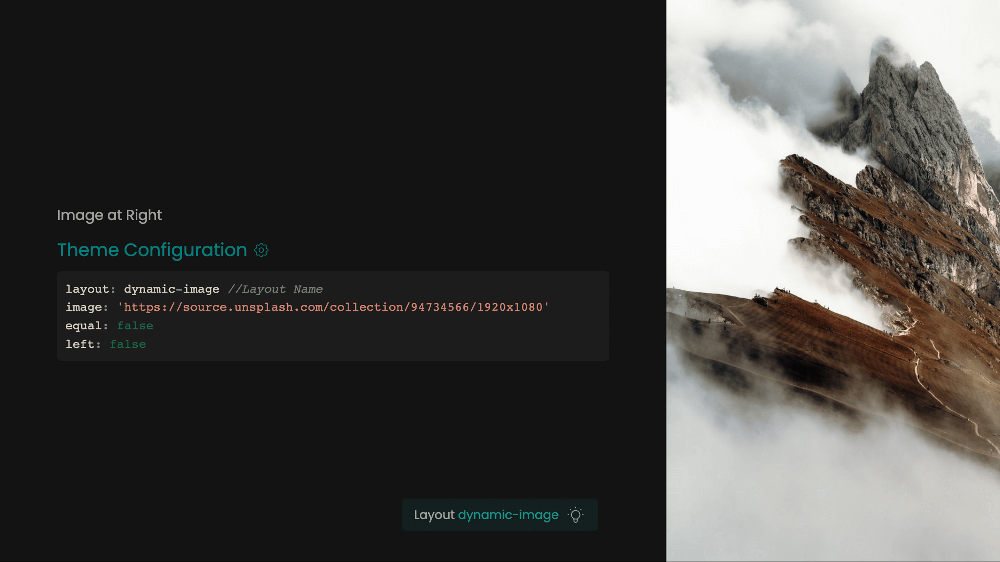

---

#### Dynamic Image `dynamic-image`
Usage:

```
---
layout: dynamic-image 
image: 'https://source.unsplash.com/collection/94734566/1920x1080'
equal: false
left: true
---
```

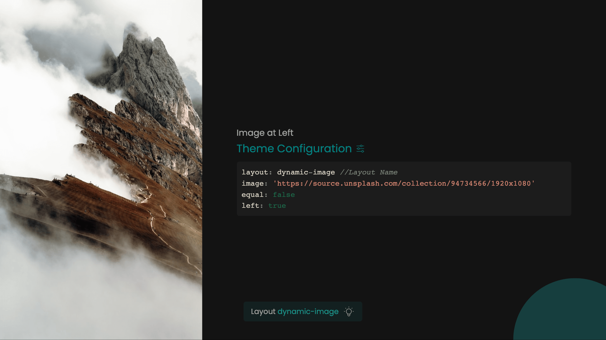

---

#### Dynamic Image `dynamic-image`
Usage:

```
---
layout: dynamic-image 
image: 'https://source.unsplash.com/collection/94734566/1920x1080'
equal: true
left: false
---
```

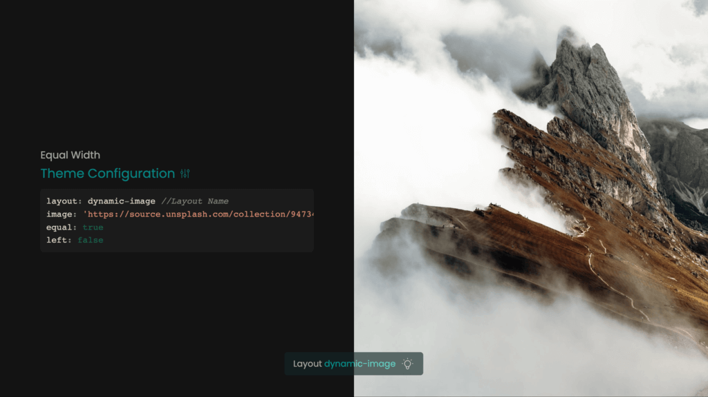

---

#### Dynamic Image `dynamic-image`
Usage:

```
---
layout: dynamic-image 
image: 'https://source.unsplash.com/collection/94734566/1920x1080'
upperImage: 'https://source.unsplash.com/collection/94734566/1920x1080'
equal: true
left: false
---
```


---

#### Image at center `dynamic-image`
Usage:

```
---
layout: center-image
image: '../assets/images/light-icons-landing2.png'
---
```

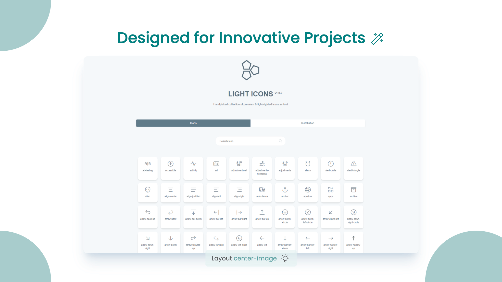

---

#### Dynamic Image `dynamic-image`
Usage:

```
---
layout: dynamic-image
image: 'https://source.unsplash.com/collection/94734566/1920x1080'
equal: false
left: false
---
```

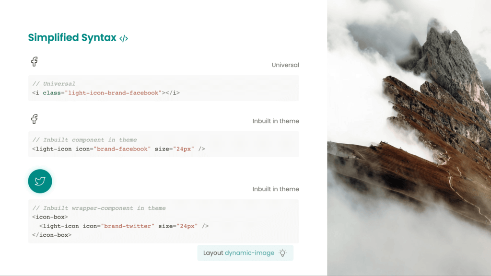

---

---

#### Image at left `left-image`
Usage:

```
---
layout: left-image
image: '../assets/images/light-vue-landing.svg'
equal: true
---
```

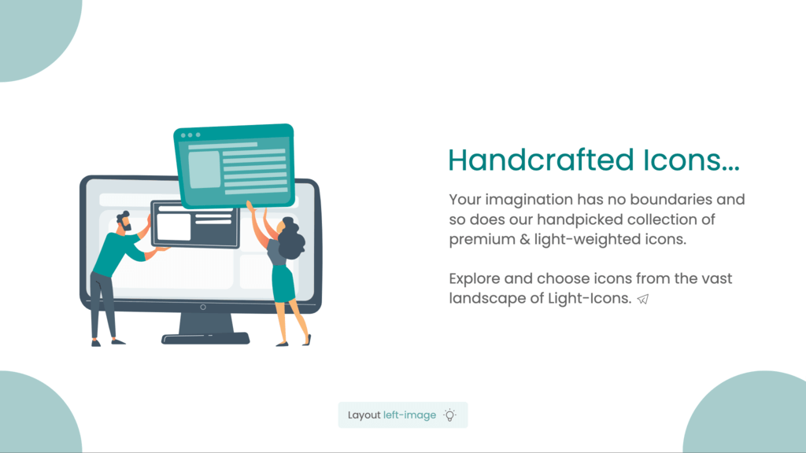


#### Image at center `dynamic-image`
Usage:

```
---
layout: center-image
---
```

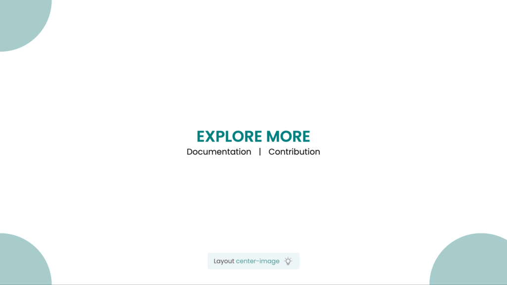


## Components

This theme provides the following components:

### `LightIcon` & `IconBox`
- For using `light-icons` wherever needed inside the theme.
- Also packed with additional `IconBox` to make the icons look elegant.


## Contributing

- `npm install`
- `npm run dev` to start theme preview of `example.md`
- Edit the `example.md` and style to see the changes
- `npm run export` to genreate the preview PDF
- `npm run screenshot` to genrate the preview PNG
